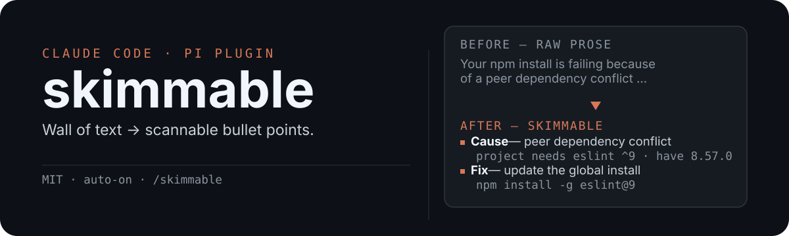

<p align="center">
  
</p>

# skimmable

Claude Code and [Pi](https://pi.dev/) plugin that formats every reply in a more readable way.

## Example

<table>
<tr>
<th>Before:</th>
<th>After:</th>
<tr>
<td>

> Your npm install is failing because there's a peer dependency conflict: the
> project requires `eslint ^9` but you have `eslint 8.57.0` installed globally,
> and `eslint-plugin-import` v2.31.0 lists `eslint >=9` as a peer dependency.
> The fix is to either update your global eslint with `npm install -g eslint@9`,
> or add an override in your `package.json` under the `overrides` key pointing
> `eslint` to `^9.0.0`. If you go the override route, make sure to run
> `npm install` again and verify the resolved version with `npm ls eslint`.

</td>
<td>

> - **Cause** — peer dependency conflict
>   - Project requires `eslint ^9`
>   - Global install has `eslint 8.57.0`
>   - `eslint-plugin-import` v2.31.0 needs `eslint >=9`
> - **Fix 1** — update the global install
> 
>   ```bash
>   npm install -g eslint@9
>   ```
> 
> - **Fix 2** — override in `package.json`
> 
>   ```json
>   { "overrides": { "eslint": "^9.0.0" } }
>   ```
> 
> Then run `npm install` and verify with `npm ls eslint` — it should resolve to `9.x`.


</td>
</tr>
</table>

More examples are available in [examples/](./examples/sonnet/).

## Install

### Claude Code

```bash
claude plugin marketplace add https://github.com/rstacruz/skimmable && claude plugin install skimmable@skimmable
```

Update to a new version with `/plugin marketplace update`.

### Pi

```bash
pi install git:github.com/rstacruz/skimmable
```

### Oh-My-Pi

```bash
curl -fsSL --create-dirs \
  https://raw.githubusercontent.com/rstacruz/skimmable/main/PERSONALITY.md \
  -o ~/.omp/agent/PERSONALITY.md
```

### All other agents

For other agents, install the ruleset manually: copy [PERSONALITY.md](./PERSONALITY.md) into your global `AGENTS.md`.

## Usage

Nothing to do — skimmable is always on; every reply is formatted.

## For Markdown files

Installing the plugin also installs the [skimmable](./skills/skimmable/SKILL.md) skill. It works great on formatting plans:

> Make plan.md /skimmable

> Summarise the top hackernews article in /skimmable format

## How it works

- **One canonical source** — the ruleset lives in [PERSONALITY.md](./PERSONALITY.md). `scripts/sync-files.sh` syncs it into the skill and the output style; CI runs the sync check on every push and PR.
- **Claude output style** — the plugin ships `output-styles/skimmable.md` with `force-for-plugin: true`, so it auto-applies. The style lives in the system prompt (survives compaction) and carries built-in per-turn adherence reminders. It replaces the old SessionStart/UserPromptSubmit hooks.
- **Pi** — the extension appends the `PERSONALITY.md` ruleset to the system prompt on every turn — pi's analogue of oh-my-pi's `PERSONALITY.md`.
- **Subagents** — the hooks used to run inside subagent sessions; output styles are main-conversation only, so subagents are no longer styled.

## Token cost

<details>
<summary>Claude Sonnet 5 (Aug 2026): 7% fewer tokens (Aug 2026)</summary>

<!-- BENCHMARK-TABLE-START -->


| Task | Normal (tokens) | Skimmable (tokens) | Saved |
|------|---------------:|-------------------:|------:|
| Explain React re-render bug | 592 | 473 | 20% |
| Fix auth middleware token expiry | 497 | 703 | -41% |
| Set up PostgreSQL connection pool | 717 | 635 | 12% |
| Explain git rebase vs merge | 714 | 656 | 8% |
| Refactor callback to async/await | 255 | 268 | -5% |
| Architecture: microservices vs monolith | 1044 | 1023 | 2% |
| Review PR for security issues | 398 | 481 | -21% |
| Docker multi-stage build | 391 | 360 | 8% |
| Debug PostgreSQL race condition | 491 | 210 | 57% |
| Implement React error boundary | 887 | 629 | 29% |
| **Average** | **599** | **544** | **7%** |

*Range: -41%–57% savings across prompts.*

<!-- BENCHMARK-TABLE-END -->

</details>

<details>
<summary>Deepseek v4 Flash: 45% more tokens (Aug 2026)</summary>


| Task | Normal (tokens) | Skimmable (tokens) | Saved |
|------|---------------:|-------------------:|------:|
| Explain React re-render bug | 1740 | 1023 | 41% |
| Fix auth middleware token expiry | 3806 | 5168 | -36% |
| Set up PostgreSQL connection pool | 2514 | 12635 | -403% |
| Explain git rebase vs merge | 896 | 855 | 5% |
| Refactor callback to async/await | 583 | 1343 | -130% |
| Architecture: microservices vs monolith | 2585 | 760 | 71% |
| Review PR for security issues | 2105 | 849 | 60% |
| Docker multi-stage build | 7927 | 2130 | 73% |
| Debug PostgreSQL race condition | 1404 | 2429 | -73% |
| Implement React error boundary | 4204 | 6798 | -62% |
| **Average** | **2776** | **3399** | **-45%** |

*Range: -403%–73% savings across prompts.*

</details>

## Special thanks

This plugin is based off of [caveman](https://github.com/JuliusBrussee/caveman) by [JuliusBrussee](https://github.com/JuliusBrussee).

## Prior art

Also check out:

- [JuliusBrussee/caveman](https://github.com/JuliusBrussee/caveman) — focused on reducing tokens
- [ayghri/i-have-adhd](https://github.com/ayghri/i-have-adhd) —  action-first
- [nextor2k/hyperfocus](https://github.com/nextor2k/hyperfocus) — multiple modes
- [Vistyy/nopus](https://github.com/Vistyy/nopus) — deterministic prose checks; requests a clearer rewrite
- [gvzdv/claudish-to-english](https://github.com/gvzdv/claudish-to-english) — plain-English rewrites via local LLM; display-only
- [raiyanyahya/justsaydone](https://github.com/raiyanyahya/justsaydone) — "done"-mode output style with `force-for-plugin`, same mechanism as this rework
